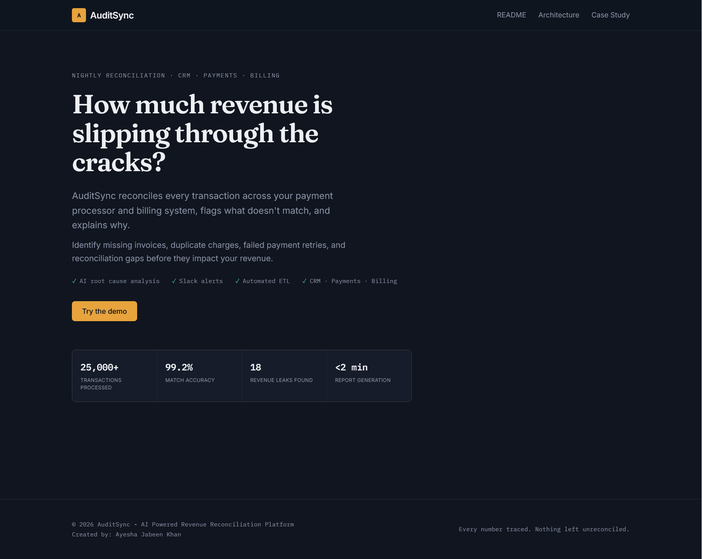
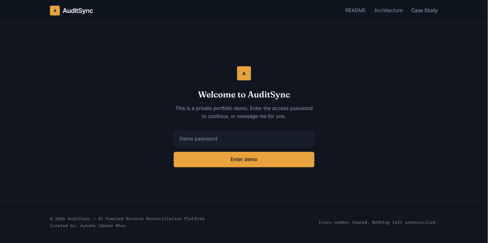
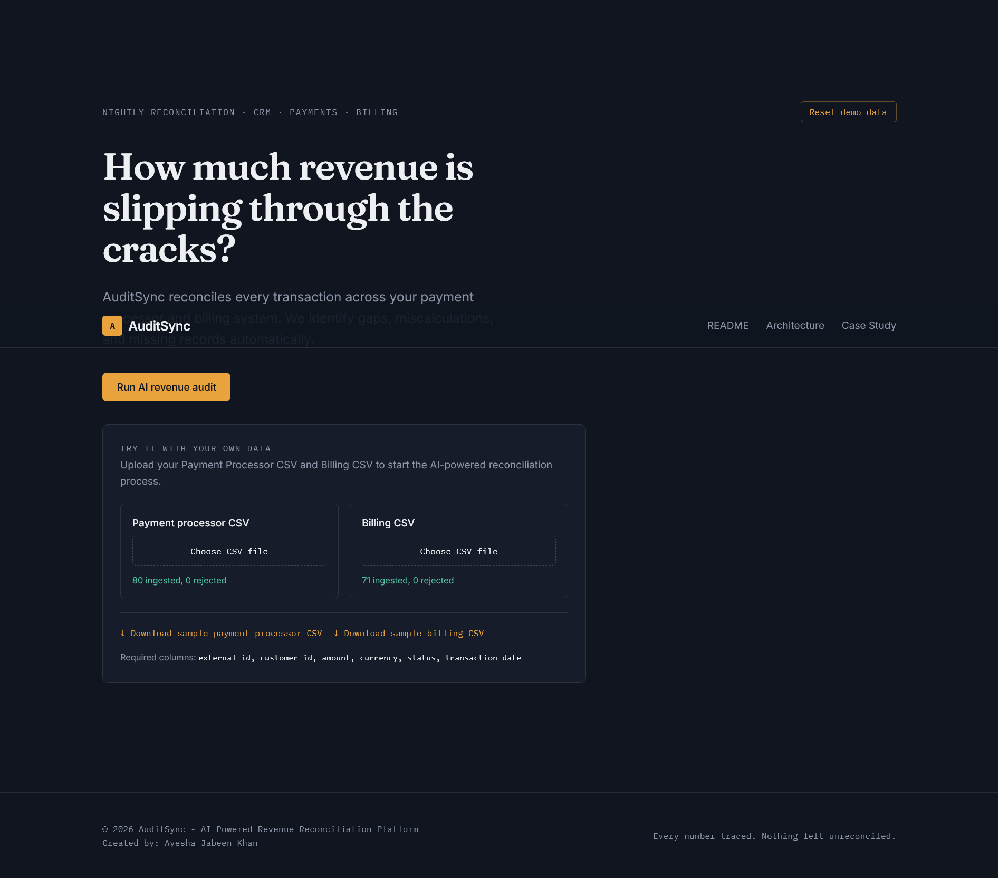
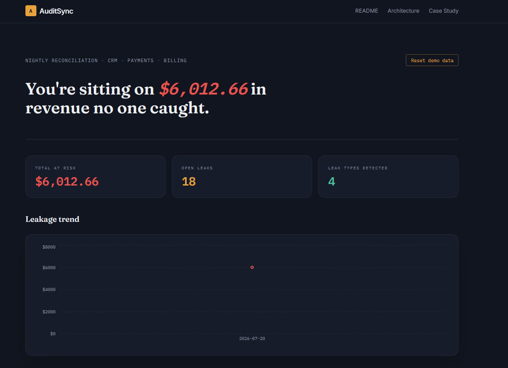
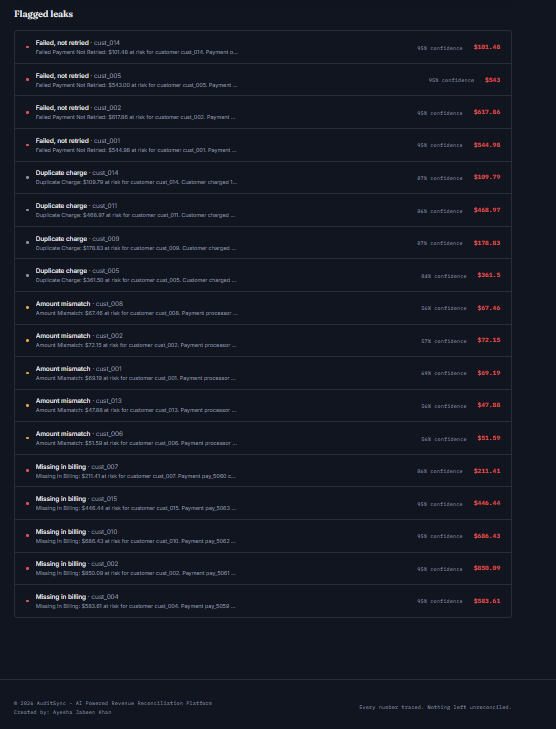
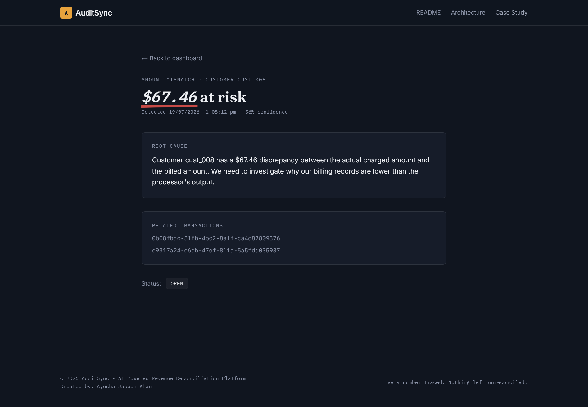

# AuditSync

**AI-powered revenue reconciliation platform.**

> Every number traced. Nothing left unreconciled.

🔗 **Live demo:** [audit-sync.vercel.app](https://audit-sync.vercel.app) · **API:** [auditsync.onrender.com](https://auditsync.onrender.com) 

*(Frontend on Vercel, backend on Render, database on Neon — the API may take a few seconds on first request after idling. The demo is password-gated — message me and I'll send you the password.)*

Note: The source code for auditsync is held in a private repository to protect proprietary multi-tenant isolation logic. This repository serves as a public breakdown of the system architecture, database schema, and case study.

AuditSync reconciles transactions across your CRM, payment gateway, and billing system, flags what doesn't match, and uses Gemini to explain *why* in plain English — then alerts your finance team on Slack before the leak grows.

## Table of Contents
- [Why](#why)
- [What it detects](#what-it-detects)
- [Try the demo yourself](#try-the-demo-yourself)
- [Bring your own data](#bring-your-own-data)
- [Screenshots](#screenshots)
- [Architecture](#architecture)
- [Tech stack](#tech-stack)
- [Project structure](#project-structure)
- [Running locally](#running-locally)
- [Notable engineering decisions](#notable-engineering-decisions)
- [Author](#author)



## Why

Revenue reconciliation across disconnected systems is usually done monthly, by hand, in spreadsheets. By the time a mismatch surfaces, the money is often uncollectable. AuditSync catches it automatically instead.

## What it detects

| Leak type | What it means |
|---|---|
| **Missing in billing** | Payment succeeded but was never invoiced |
| **Duplicate charge** | Same customer charged the same amount twice within 24h |
| **Amount mismatch** | Payment processor and billing system disagree on the charge |
| **Failed, not retried** | Payment failed and was never retried — silent, permanent loss |

Every leak gets a **confidence score calculated from the actual transaction signals** (not a flat number per leak type) and an AI-generated root cause, e.g.:

> *Duplicate Charge: $178.83 at risk for customer cust_009. Customer charged 178.83 twice within 24h (pay_5073 and pay_5074).*

## Try the demo yourself

The live demo is password-gated — a simple screen sits in front of the actual tool so I can share the link publicly without it turning into an open sandbox for strangers. Ask me for the password and you're straight in.



Once inside, you can either:
- Click **"Run AI revenue audit"** to see the tool work against a realistic seeded dataset, or
- **Upload your own Payment Processor and Billing CSVs** and watch it reconcile your actual data.

## Bring your own data

Upload panel is right on the dashboard. It checks your CSV's column headers **client-side, before anything is sent to the backend** — so a wrong file gives you an instant, specific error ("missing columns: X, Y") instead of a confusing failure after the fact. Once it's validated, it runs through the exact same reconciliation engine as the seeded demo data — no simplified preview version.



Required columns: `external_id, customer_id, amount, currency, status, transaction_date`

Don't have a CSV handy? Sample files are one click away — download them, look at the format, and re-upload them right back in to see the whole thing work end to end.

A **"Reset demo data"** button clears everything back to a clean slate (a real backend endpoint, not a manual database edit on my end), so the shared demo never gets messy for the next person trying it.

## Screenshots

| Dashboard — stats & flagged leaks |
|---|
|  |
|  |

| Leak detail |
|---|
|  |

## Architecture

See [docs/architecture.md](docs/architecture.md) for the full data flow, design decisions, and diagram.

```
CRM ─┐
Payments ─┼─► Reconciliation engine ─► Confidence scoring ─► Gemini AI ─► PostgreSQL
Billing ─┘                ▲                                                    │
                           │                                                    ▼
           User-uploaded CSVs (validated client-side) ──►          Password-gated dashboard
```

## Tech stack

**Frontend:** Next.js (App Router), TypeScript, TailwindCSS, shadcn/ui, Recharts — mobile-responsive
**Backend:** FastAPI, Pydantic, SQLAlchemy, Pandas/NumPy
**AI:** Gemini API — batched root-cause generation per reconciliation run
**Database:** PostgreSQL (hosted on Neon)
**Automation:** n8n — scheduled reconciliation + Slack alerting
**Infra:** Docker + docker-compose locally · deployed on Vercel (frontend) + Render (backend)

## Project structure

```
auditsync/
├── backend/
│   ├── app/
│   │   ├── db/            # SQLAlchemy models & session
│   │   ├── routers/        # API endpoints (incl. CSV upload, reset)
│   │   ├── schemas/        # Pydantic request/response models
│   │   ├── services/       # reconciliation engine, confidence scoring, Gemini integration
│   │   ├── tests/
│   │   ├── config.py
│   │   └── main.py
│   ├── seed_data/           # sample CRM / payments / billing fixtures
│   ├── requirements.txt
│   ├── Dockerfile
│   └── .env.example
├── frontend/
│   ├── app/
│   │   ├── dashboard/page.tsx     # the actual tool (password-gated)
│   │   ├── leaks/[id]/page.tsx    # leak detail view
│   │   ├── layout.tsx
│   │   └── page.tsx               # marketing / landing page
│   ├── components/
│   │   ├── LeakChart.tsx
│   │   ├── LeakFeed.tsx
│   │   ├── CsvUploader.tsx
│   │   ├── DemoGate.tsx           # password screen
│   │   └── ui/
│   └── .env.local
├── n8n/
│   └── auditsync-nightly-sync.json
├── docs/
│   └── architecture.md
├── screenshots/
└── docker-compose.yml
```

## Running locally

```bash
# Backend
cd backend
python -m venv venv && source venv/Scripts/activate   # venv/bin/activate on macOS/Linux
pip install -r requirements.txt
cp .env.example .env   # set DATABASE_URL, GEMINI_API_KEY
uvicorn app.main:app --reload

# Frontend
cd frontend
npm install
npm run dev
```

Or fully containerized:

```bash
docker-compose up --build
```

Import `n8n/auditsync-nightly-sync.json` into your n8n instance to enable the scheduled reconciliation + Slack alert workflow.

## Notable engineering decisions

- **Idempotent reconciliation.** Found this one the hard way — clicking "reconcile" twice was silently duplicating every leak. Fixed with a per-transaction `reconciled` watermark, so re-running the job is always safe no matter how many times it's triggered.
- **Confidence scores are calculated, not hardcoded.** An earlier version returned a flat confidence number per leak type (always 90% for one type, always 85% for another) — which looked fine in a demo but wasn't actually measuring anything. Fixed so confidence now comes from the real signal: how large a missing payment is, how close together duplicate charges are, how long a failed payment has gone unretried.
- **Client-side CSV validation before the backend ever sees the file.** Catching a wrong file format (missing or misnamed columns) in the browser means the person uploading gets an instant, specific error instead of a vague failure a few seconds later — a small thing that makes the tool feel like a real product, not a fragile demo.
- **A simple password gate instead of full auth.** The demo needed to be shareable on LinkedIn without becoming an open sandbox, but didn't need real user accounts at this stage. A lightweight password screen in front of the dashboard was the right-sized solution — full authentication is the obvious next step if this became a real multi-user product.
- **Accurate failed-payment matching.** A retry only resolves a prior failure if the amount matches, avoiding false negatives from unrelated transactions.
- **Resilient AI calls.** Root-cause generation is batched per run (not per leak) to respect Gemini rate limits, with a templated fallback if the API is unavailable.

## Author

Built by **Ayesha Jabeen Khan**.
